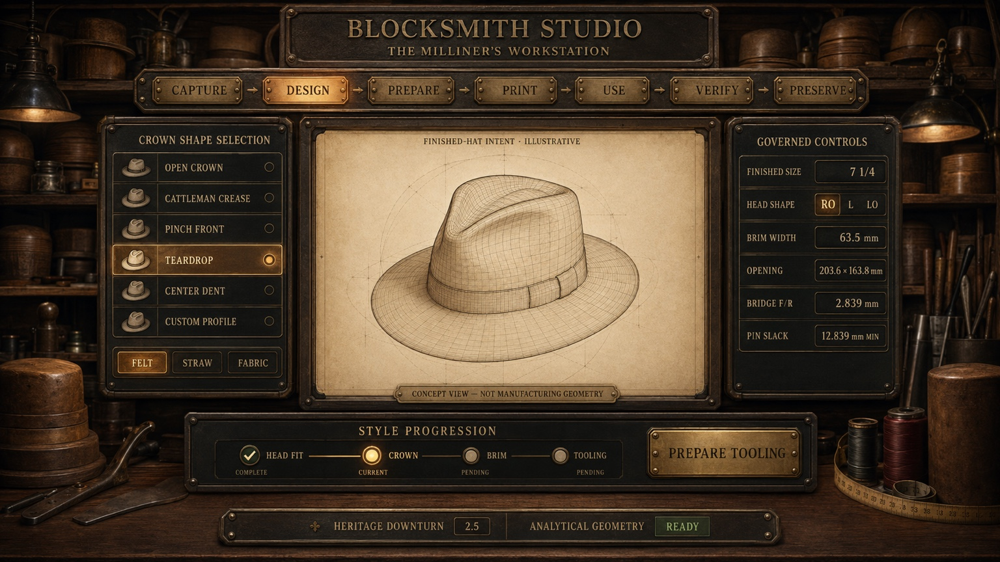

# Blocksmith

**Blocksmith Studio — The Milliner's Workstation** is a free, local-first system for designing, preparing, printing, using, and preserving parametric hatmaking tooling.

> Built by Rich and Codex—because the cost of making a hat was just too damn high.



## What v0.1 does

This foundation build makes the **Hat Project**—not a loose STL—the primary record. A first-time user can:

1. Capture a finished hat size or measured circumference.
2. Start with a built-in standard profile: Round Oval (RO), Regular Oval (R), Long Oval (LO), or Extra-Long Oval (XLO).
3. Generate a **standard open-crown block** without uploading a personal trace.
4. Preview both the governed open-crown tooling and five later finished-hat intents.
5. Record pin-fit and XY calibration evidence.
6. Export a closed, quarter-scale proof STL.
7. Unlock a clearly labeled **prototype** full-scale R-profile export only after the calibration and mesh gates pass.
8. Record printer, filament, forming, and inspection information.
9. Export an editable `.blocksmith.json` project record and a shop traveler.

All project data autosaves in the browser on the user's device. There is no account, cloud database, or telemetry in this build.

## Geometry honesty

Blocksmith is pre-alpha engineering software. The interface deliberately distinguishes mathematical, reference-calibrated, and physically validated work.

- The **R opening** reproduces the BMFS v0.2 baseline of approximately **193.900 × 168.530 mm at 570 mm circumference**.
- The open-crown surface generator produces a closed manifold mesh and is covered by automated dimensional/topology tests.
- The new crown surface has **not yet completed full-size physical validation**.
- RO, LO, and XLO ratios are provisional and remain guarded from full-scale export.
- The pin-fit workflow preserves the empirical 3.00–3.50 mm horizontal-hole coupon. Prototype 003 established 3.15 mm modeled holes for the measured 3.00 mm pins used in that test; every printer/material combination must still be calibrated.

Read [Geometry Status](docs/GEOMETRY_STATUS.md) before printing. The latest simulated first-use walkthrough and the remaining live-participant questions are in [New-User Test Results](docs/NEW_USER_TEST_RESULTS_2026-08-18.md).

## Local development

Requirements: Node.js 22 or newer.

```bash
npm install
npm run dev
```

Validation:

```bash
npm run check
```

The development build is a stepping stone toward signed Windows, macOS, and Linux installers plus a Chromebook-capable offline web application. End users should not ultimately need a terminal.

## Repository map

- `src/domain/` — sizing, profiles, geometry, calibration, project schema, and STL export
- `src/components/` — interactive tooling/finished-hat visualization
- `tests/` — numerical, topology, export, calibration, and hosting checks
- `docs/` — product intent, validation state, roadmap, and new-user test
- `openscad/` — source-preserving calibration utilities
- `public/assets/` — the supplied visual reference and optimized finished-intent illustration assets
- `design-qa.md` — source-to-browser comparison history and passing visual gate

## Project principles

- Precision in the engine, simplicity for the user, and a little soul everywhere else.
- Open Crown first; personalized traces optional.
- Capture → Design → Prepare → Print → Use → Verify → Preserve.
- Dual units and plain-language explanations.
- Local-first privacy and open, versioned project data.
- Physical validation before production claims.
- Honest forks are welcome; impersonation is not.

## Licensing

Software in this initial repository is offered under **GNU AGPL-3.0-or-later**. The intended multi-license structure for future printable hardware and documentation is recorded in [LICENSING.md](docs/LICENSING.md) and remains subject to legal review before a public production release.

Contributions use Developer Certificate of Origin sign-off; see [CONTRIBUTING.md](CONTRIBUTING.md).
